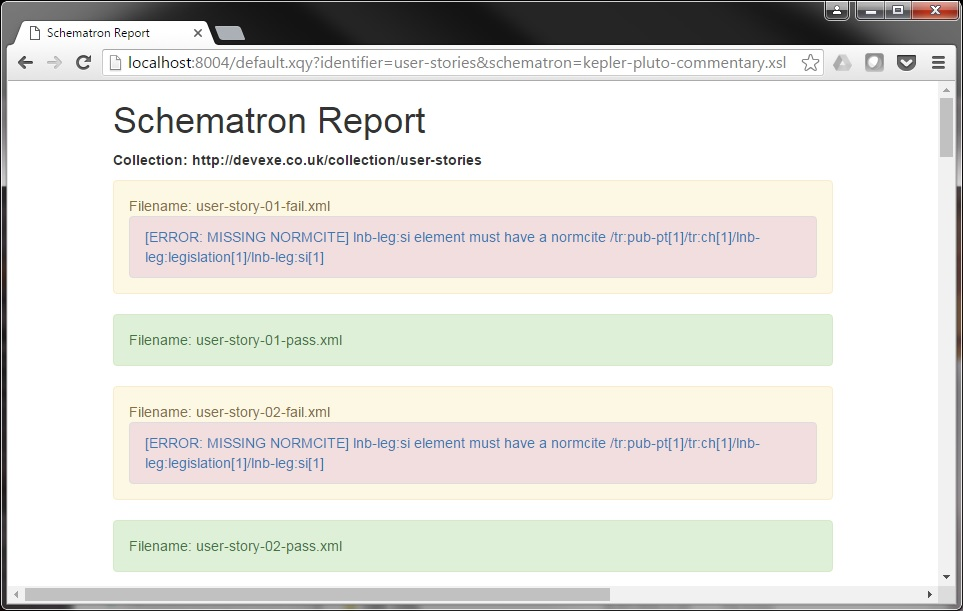

# Schematron Validation Tool #

This is an XQuery application which can be deployed to a MarkLogic server and used to validate XML content using [Schematron](http://www.schematron.com/). The validation reports are rendered in HTML using [Bootstrap](http://getbootstrap.com/) and can be accessed over HTTP.

**Prerequisites for deployment**

The following command line tools should be installed. It is recommended to add them to your *Path* environment variable so that they are available from any directory:

- [cURL](https://curl.haxx.se/)
- [MarkLogic Content Pump](https://developer.marklogic.com/products/mlcp)

**Also required**

- XML files for validation
- An XSLT Schematron file to validate with*

\*Must be placed in the `src\schematron` sub directory of the project.   

If you are a Windows user it is recommended that you install [Cygwin](https://www.cygwin.com/) in order to access cURL.  

**Deploying the tool:**

The following commands assume you are working from the base directory of the this project and make use of the config files in the `config` subdirectory. Make sure that the correct hostname has been entered in the `modules-forest.xml` and `content-forest.xml` files and that an available port number has been entered in the `http-server.xml` file.

`{username:password}` should be replaced with the admin users actual username and password and `{hostname}` should be replaced with the correct host server name. For example, if you are using MarkLogic on your local machine the host would be `localhost`.

To create the content database:
	
	curl --anyauth --user {username:password} -X POST -d@./config/content-db.xml -i -H "Content-type: application/xml" http://{hostname}:8002/manage/v2/databases

To create the content forest:

	curl --anyauth --user {username:password} -X POST -d@./config/content-forest.xml -i -H "Content-type: application/xml" http://{hostname}:8002/manage/v2/forests

To create the module database:

	curl --anyauth --user {username:password} -X POST -d@./config/modules-db.xml -i -H "Content-type: application/xml" http://{hostname}:8002/manage/v2/databases

To create the module forest:

	curl --anyauth --user {username:password} -X POST -d@./config/modules-forest.xml -i -H "Content-type: application/xml" http://{hostname}:8002/manage/v2/forests

To create the HTTP server:

	curl --digest --user {username:password} -H "Content-type: application/xml" -d @./config/http-server.xml 'http://{hostname}:8002/manage/v2/servers?group-id=Default&server-type=http'

*Please note* that if the [Management API](https://docs.marklogic.com/REST/management) of the MarkLogic server cannot be accessed via HTTP then the properties in the config files will need to manually entered into the [Admin Interface](https://docs.marklogic.com/guide/admin/admin_inter).

**Populating the modules database:**

The modules database contains all of the source code (XQuery, XSLT and Schematron) needed to run the validator tool.

Before loading these files make sure that your Schematron XSLT has been placed into the `src/schematron` directory of the project.

These files are loaded into the database using MarkLogic Content Pump. For convenience there are Windows batch and Unix shell script files for performing this task. Run either `load-modules.bat` or `load-modules.sh` as appropriate.

**Populating the content database:**

The content database contains all of the data which the app needs. 

    mlcp import -host {hostname} -port {port} -username {username} -password {password} -database rosetta-content -input_file_path C:\{path}\data\rosetta -output_permissions "CA-Developer-Role,read,Tester,read,Editorial,read" -output_uri_replace "/C:/{path},'http://lexisnexis.co.uk'" -output_collections rosetta-xml

For running mlcp commands there are parametrised batch files written for each database and environment in the root directory of this project. These can be modified and run from the command line to save having to type out all of the arguments for each set of data being loaded.

It is also possible to bulk load multiple directories of content into the QA Tool using the [MLCP Bulk Loader](https://github.com/rwalpole/mlcp-bulk-loader). For convenience a compiled copy of the JAR file for this is available in the `lib` directory of this project.

**Usage**

To access your Schematron report enter the MarkLogic hostname and application port (specified in the `http-server.xml` config file) followed by `/default.xqy` and the URL parameters `identifier` and `schematron` into your browser, where `identifier` is the identifier used during content loading (which is also used to create the collection name) and `schematron` is the name of the schematron file you have loaded and want to apply. For example:

Files that pass validation are shown with a green background and files that fail are shown with a yellow background. Errors are shown with a red background and warnings with a yellow backgroun. Clicking on the error or warning will show the XML of the section of file that is failing validation.  

**Special Notes:**

1. The application root should always be a URI, e.g. `http://devexe.co.uk/apps/validator`
2. The URI for data files should be set to something appropriate during ingest via MLCP using the `-output_uri_replace` parameter. e.g. `http://devexe.co.uk/data/user-stories`
3. XQuery modules must end with `.xqy` for their type to be correctly identified.
4. `<xsl:include>` and `<xsl:import>` within XSLT files must have an href relative to the application root and must start with a forward slash.
5. If you are unable to see files which have been loaded into the database then the most likely explanation is that the permissions have not been properly set. You will not receive any kind of permissions error!